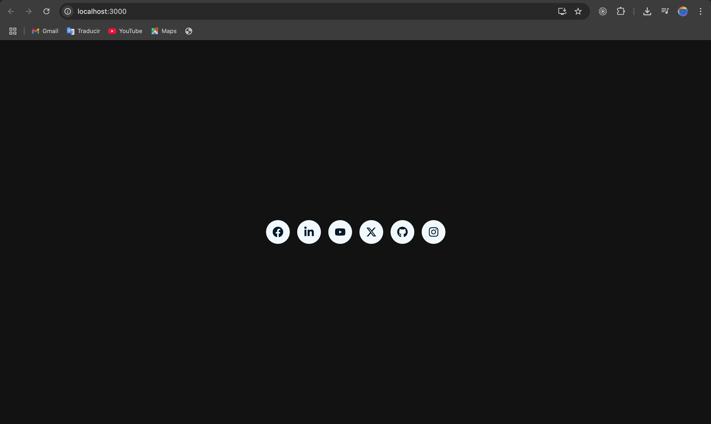

# Social Icons

An amazing animation to show off your social icons.

## first clone this repo using Git

and then run the scripts

## Available Scripts

In the project directory, you can run:

### `npm install`

### `npm start`

Runs the app in the development mode.\
Open [http://localhost:3000](http://localhost:3000) to view it in your browser.

The page will reload when you make changes.\
You may also see any lint errors in the console.

### `npm run build`

Builds the app for production to the `build` folder.\
It correctly bundles React in production mode and optimizes the build for the best performance.

The build is minified and the filenames include the hashes.\
Your app is ready to be deployed!

See the section about [deployment](https://facebook.github.io/create-react-app/docs/deployment) for more information.

## Authors

**Cecilia Benitez**

- [@Ceci007](https://github.com/Ceci007)

## 📝 License

This project is [FIUNA](https://www.ing.una.py/FIUNA3/) licensed.
